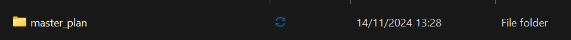
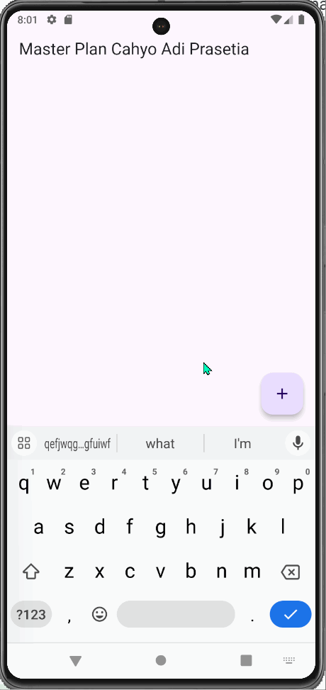
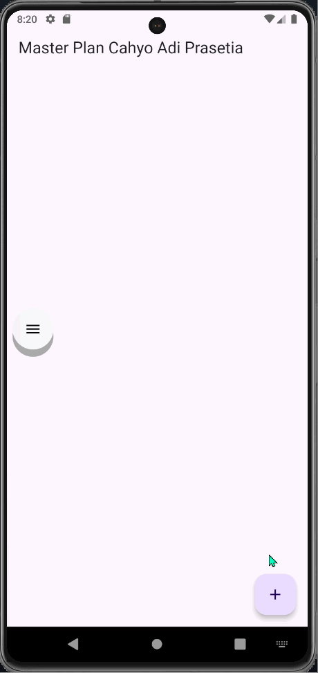

# Praktikum 1: Dasar State dengan Model-View

#### **Langkah 1: Buat Project Baru**


#### **Langkah 2: Membuat model ``task.dart``**
```dart
class Task {
  final String description;
  final bool complete;

  const Task({
    this.complete = false,
    this.description = '', 
  });
}
```

#### **Langkah 3: Buat file ``plan.dart``**
```dart
import './task.dart';

class Plan {
  final String name;
  final List<Task> tasks;

  const Plan({
    this.name = '', 
    this.tasks = const []
  });
}
```

#### **Langkah 4: Buat file ``data_layer.dart``**
```dart
export 'plan.dart';
export 'task.dart';
```

#### **Langkah 5: Pindah ke file ``main.dart``**
```dart
import 'package:flutter/material.dart';
import './views/plan_screen.dart';

void main() => runApp(MasterPlanApp());

class MasterPlanApp extends StatelessWidget {
  const MasterPlanApp({super.key});

  @override
  Widget build(BuildContext context) {
    return MaterialApp(
      theme: ThemeData(primarySwatch: Colors.purple),
      home: PlanScreen(),
      debugShowCheckedModeBanner: false,
    );
  }
}
```

#### **Langkah 6: buat ``plan_screen.dart``**
```dart
import '../models/data_layer.dart';
import 'package:flutter/material.dart';

class PlanScreen extends StatefulWidget {
  const PlanScreen({super.key});

  @override
  State createState() => _PlanScreenState();
}

class _PlanScreenState extends State<PlanScreen> {
  Plan plan = const Plan();

    @override
  Widget build(BuildContext context) {
    return Scaffold(
      appBar: AppBar(title: const Text('Master Plan Cahyo Adi Prasetia')),
      body: _buildList(),
      floatingActionButton: _buildAddTaskButton(),
    );
  }
```

#### **Langkah 7: buat method ``_buildAddTaskButton``**
```dart
  Widget _buildAddTaskButton() {
    return FloatingActionButton(
      child: const Icon(Icons.add),
      onPressed: () {
        setState(() {
          plan = Plan(
            name: plan.name,
            tasks: List<Task>.from(plan.tasks)
            ..add(const Task())
          );
        });
      },
    );
  }
```

#### **Langkah 8: buat widget ``_buildList``**
```dart
  Widget _buildList() {
    return ListView.builder(
      itemCount: plan.tasks.length,
      itemBuilder: (context, index) =>
      _buildTaskTile(plan.tasks[index], index),
    );
  }

```

#### **Langkah 9: buat widget ``_buildTaskTile``**
```dart
  Widget _buildTaskTile(Task task, int index) {
    return ListTile(
      leading: Checkbox(
        value: task.complete,
        onChanged: (selected) {
          setState(() {
            plan = Plan(
              name: plan.name,
              tasks: List<Task>.from(plan.tasks)
              ..[index] = Task(
                description: task.description,
                complete: selected ?? false,
              ),
            );
          });
        },
      ),
      title: TextFormField(
        initialValue: task.description,
        onChanged: (text) {
          setState(() {
            plan = Plan(
              name: plan.name,
              tasks: List<Task>.from(plan.tasks)
              ..[index] = Task(
                description: text,
                complete: task.complete,
              ),
            );
          });
        },
      ),
    );
  }
```

#### **Langkah 10: Tambah Scroll Controller**\
```dart
class _PlanScreenState extends State<PlanScreen> {
  Plan plan = const Plan();
  late ScrollController scrollController;
```

#### **Langkah 11: Tambah Scroll Listener**
Tambahkan method initState() setelah deklarasi variabel scrollController seperti kode berikut.
```dart
  @override
  void initState() {
    super.initState();
    scrollController = ScrollController()
    ..addListener(() {
      FocusScope.of(context).requestFocus(FocusNode());
    });
  }
```

#### **Langkah 12: Tambah controller dan keyboard behavior**
```dart
 return ListView.builder(
      controller: scrollController,
      keyboardDismissBehavior: Theme.of(context).platform ==
      TargetPlatform.iOS
                ? ScrollViewKeyboardDismissBehavior.onDrag
                : ScrollViewKeyboardDismissBehavior.manual,
```

#### **Langkah 13: Terakhir, tambah method dispose()**
```dart
  @override
  void dispose() {
    scrollController.dispose();
    super.dispose();
  }
```

#### **Langkah 14: Hasil**


# **Tugas Praktikum 1: Dasar State dengan Model-View**

1. Selesaikan langkah-langkah praktikum tersebut, lalu dokumentasikan berupa GIF hasil akhir praktikum beserta penjelasannya di file README.md! Jika Anda menemukan ada yang error atau tidak berjalan dengan baik, silakan diperbaiki.
2. Jelaskan maksud dari langkah 4 pada praktikum tersebut! Mengapa dilakukan demikian?
3. Mengapa perlu variabel plan di langkah 6 pada praktikum tersebut? Mengapa dibuat konstanta ?
4. Lakukan capture hasil dari Langkah 9 berupa GIF, kemudian jelaskan apa yang telah Anda buat!
5. Apa kegunaan method pada Langkah 11 dan 13 dalam lifecyle state ?


**Jawaban**

2. Karena langkah tersebut digunakan untuk membungkus beberapa data layer ke dalam sebuah file yang nanti akan mengekspor kedua model tersebut.

3. Karena digunakan untuk menyimpan data yang akan digunakan dalam aplikasi. Variabel plan dibuat konstanta agar data yang disimpan tidak dapat diubah.

4. Saya membuat widget _buildTaskTile untuk membuat tile task.\


5. Pada langkah 11 digunakan untuk menambahkan listener pada scroll controller, sedangkan pada langkah 13 digunakan untuk membersihkan scroll controller.
