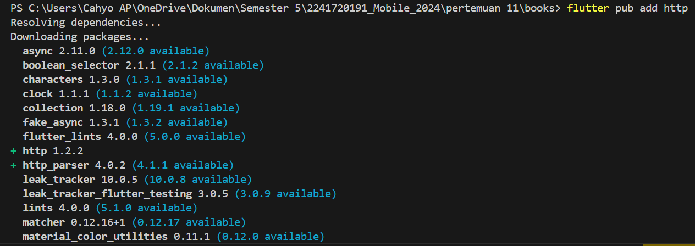
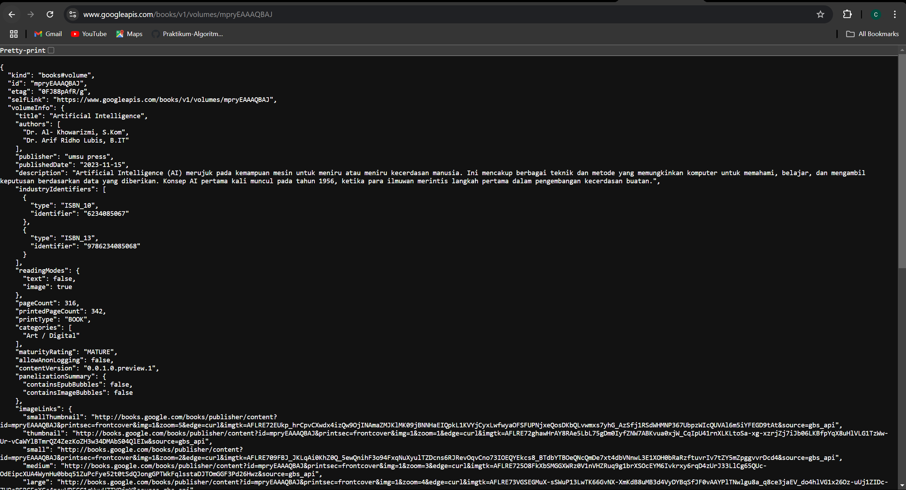

# **Praktikum 1: Mengunduh Data dari Web Service (API)**

#### **Langkah 1: Buat Project Baru**
\
Kemudian Tambahkan dependensi ``http`` dengan mengetik perintah berikut di terminal.


#### **Langkah 2: Cek file ``pubspec.yaml``**
```dart
dependencies:
  flutter:
    sdk: flutter


  # The following adds the Cupertino Icons font to your application.
  # Use with the CupertinoIcons class for iOS style icons.
  cupertino_icons: ^1.0.8
  http: ^1.2.2
```

#### **Langkah 3: Buka file ``main.dart``**
**Soal 1**\
Tambahkan **nama panggilan Anda** pada ``title`` app sebagai identitas hasil pekerjaan Anda.
```dart
import 'dart:async';
import 'package:flutter/material.dart';
import 'package:http/http.dart';
import 'package:http/http.dart' as http;

void main() {
  runApp(const MyApp());
}

class MyApp extends StatelessWidget {
  const MyApp({super.key});

  @override
  Widget build(BuildContext context) {
    return MaterialApp(
      title: 'Cahyo', // Soal 1
      theme: ThemeData(
        primarySwatch: Colors.blue,
        visualDensity: VisualDensity.adaptivePlatformDensity
      ),
      home: const FuturePage(),
    );
  }
}

class FuturePage extends StatefulWidget {
  const FuturePage({super.key});

  @override
  State<FuturePage> createState() => _FuturePageState();
}

class _FuturePageState extends State<FuturePage> {
  String result = '';
  
  @override
  Widget build(BuildContext context) {
    return Scaffold(
      appBar: AppBar(
        title: const Text('Back from the Future'),
      ),
      body: Center(
        child: Column(children: [
          const Spacer(),
          ElevatedButton(
            child: const Text('Go!'),
            onPressed: () {}, 
            ),
            const Spacer(),
            Text(result),
            const Spacer(),
            const CircularProgressIndicator(),
            const Spacer(),
        ]),
      ),
    );
  }
}
```

#### **Langkah 4: Tambah method ``getData()``**
```dart
  Future<Response> getData() async {
    const authority = 'www.googleapis.com';
    const path = '/books/v1/volumes/mpryEAAAQBAJ';

    Uri url = Uri.https(authority, path);
    return http.get(url);
  }
```
**Soal 2**\
Carilah judul buku favorit Anda di Google Books, lalu ganti ID buku pada variabel path di kode tersebut.
