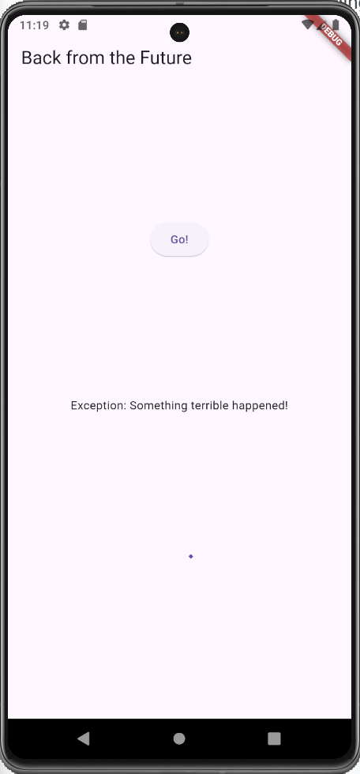
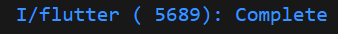
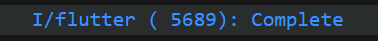
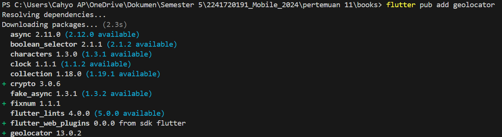
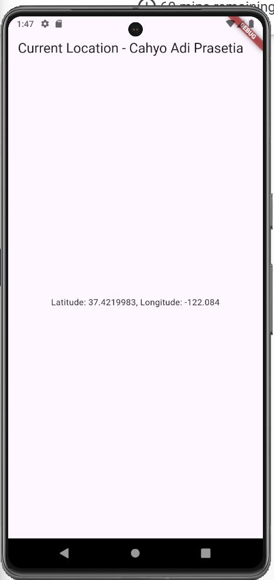

# **Praktikum 1: Mengunduh Data dari Web Service (API)**

#### **Langkah 1: Buat Project Baru**
\
Kemudian Tambahkan dependensi ``http`` dengan mengetik perintah berikut di terminal.


#### **Langkah 2: Cek file ``pubspec.yaml``**
```dart
dependencies:
  flutter:
    sdk: flutter


  # The following adds the Cupertino Icons font to your application.
  # Use with the CupertinoIcons class for iOS style icons.
  cupertino_icons: ^1.0.8
  http: ^1.2.2
```

#### **Langkah 3: Buka file ``main.dart``**
**Soal 1**\
Tambahkan **nama panggilan Anda** pada ``title`` app sebagai identitas hasil pekerjaan Anda.
```dart
import 'dart:async';
import 'package:flutter/material.dart';
import 'package:http/http.dart';
import 'package:http/http.dart' as http;

void main() {
  runApp(const MyApp());
}

class MyApp extends StatelessWidget {
  const MyApp({super.key});

  @override
  Widget build(BuildContext context) {
    return MaterialApp(
      title: 'Cahyo', // Soal 1
      theme: ThemeData(
        primarySwatch: Colors.blue,
        visualDensity: VisualDensity.adaptivePlatformDensity
      ),
      home: const FuturePage(),
    );
  }
}

class FuturePage extends StatefulWidget {
  const FuturePage({super.key});

  @override
  State<FuturePage> createState() => _FuturePageState();
}

class _FuturePageState extends State<FuturePage> {
  String result = '';
  
  @override
  Widget build(BuildContext context) {
    return Scaffold(
      appBar: AppBar(
        title: const Text('Back from the Future'),
      ),
      body: Center(
        child: Column(children: [
          const Spacer(),
          ElevatedButton(
            child: const Text('Go!'),
            onPressed: () {}, 
            ),
            const Spacer(),
            Text(result),
            const Spacer(),
            const CircularProgressIndicator(),
            const Spacer(),
        ]),
      ),
    );
  }
}
```

#### **Langkah 4: Tambah method ``getData()``**
```dart
  Future<Response> getData() async {
    const authority = 'www.googleapis.com';
    const path = '/books/v1/volumes/mpryEAAAQBAJ';

    Uri url = Uri.https(authority, path);
    return http.get(url);
  }
```
**Soal 2**\
Carilah judul buku favorit Anda di Google Books, lalu ganti ID buku pada variabel path di kode tersebut.


#### **Langkah 5: Tambah kode di ElevatedButton**
Menambahkan kode untuk memanggil method getData() pada ElevatedButton.
```dart
ElevatedButton(
              onPressed: () {
                setState(() {});
                getData().then((value) {
                  result = value.body.toString().substring(0, 450);
                  setState(() {});
                }).catchError((_) {
                  result = 'An error occured';
                  setState(() {});
                });
              },
```
**Soal 3**\
Jelaskan maksud kode langkah 5 tersebut terkait ``substring`` dan ``catchError``!
>Jawab: 
``substring`` digunakan untuk mengambil data dari index tertentu pada string. ``catchError`` digunakan untuk menangkap error yang terjadi pada kode.\
.gif)

# **Praktikum 2: Menggunakan await/async untuk menghindari callbacks**

#### **Langkah 1: Buka file ``main.dart``**
Tambahkan tiga method berisi kode seperti berikut di dalam class ``_FuturePageState``.
```dart
 Future<int> returnOneAsync() async {
    await Future.delayed(const Duration(seconds: 3));
    return 1;
  }

  Future<int> returnTwoAsync() async {
    await Future.delayed(const Duration(seconds: 3));
    return 2;
  }

  Future<int> returnThreeAsync() async {
    await Future.delayed(const Duration(seconds: 3));
    return 3;
  }
```

#### **Langkah 2: Tambah method ``count``**
Lalu tambahkan lagi method ini di bawah ketiga method sebelumnya.
```dart
  Future count() async {
    int total = 0;
    total = await returnOneAsync();
    total += await returnTwoAsync();
    total += await returnThreeAsync();
    setState(() {
      result = total.toString();
    });
  }
```

#### **Langkah 3: Panggil ``count``**
Lakukan comment kode sebelumnya, ubah isi kode onPressed() menjadi seperti berikut.
```dart
            ElevatedButton(
              // onPressed: () {
              //   // setState(() {});
              //   // getData().then((value) {
              //   //   result = value.body.toString().substring(0, 450);
              //   //   setState(() {});
              //   // }).catchError((_) {
              //   //   result = 'An error occured';
              //   //   setState(() {});
              //   // });
              // },
              child: const Text('Go!'),
              onPressed: () {
                count();
              },
            ),
```
**Soal 4**
* Jelaskan maksud kode langkah 1 dan 2 tersebut!\
Jawab:\
Kode di atas melakukan tiga operasi asynchronous dengan jeda waktu 3 detik untuk setiap fungsi (returnOneAsync, returnTwoAsync, returnThreeAsync). Fungsi count menghitung total hasil dari ketiga fungsi tersebut secara berurutan (serial). Setelah hasil total dihitung, nilai tersebut diperbarui ke dalam state result menggunakan setState, sehingga dapat ditampilkan di UI.

* Capture hasil praktikum Anda berupa GIF dan lampirkan di README. Lalu lakukan commit dengan pesan **"W11: Soal 4"**.\
Jawab:\
.gif)

# **Praktikum 3: Menggunakan Completer di Future**

#### **Langkah 1: Buka ``main.dart``**
Pastikan telah impor package async berikut.
```dart
import 'package:async/async.dart';
```

#### **Langkah 2: Tambahkan variabel dan method**
Tambahkan variabel late dan method di class ``_FuturePageState`` seperti ini.
```dart
late Completer completer;

Future getNumber() {
  completer = Completer<int>();
  calculate();
  return completer.future;
}

Future calculate() async {
  await Future.delayed(const Duration(seconds : 5));
  completer.complete(42);
}
```

#### **Langkah 3: Ganti isi kode ``onPressed()``**
```dart
onPressed: () {
                // count();
                getNumber().then((value){
                  setState(() {
                    result = value.toString();
                  });
                });
              },
```
**Soal 5**
* Jelaskan maksud kode langkah 2 tersebut!\
Jawab:\
``Completer`` digunakan untuk mengontrol penyelesaian dari sebuah ``Future`` secara manual. Fungsi ``getNumber`` membuat sebuah ``Completer`` dan memulai proses ``calculate``.
``calculate`` menunggu selama 5 detik (``Future.delayed``) lalu menyelesaikan ``Completer`` dengan nilai ``42``.
Dan terakhir nilai ``42`` akan muncul sebagai hasil dari ``completer.future`` setelah proses selesai.

* Capture hasil praktikum Anda berupa GIF dan lampirkan di README. Lalu lakukan commit dengan pesan **"W11: Soal 5"**.\
Jawab:\
.gif)

#### **Langkah 5: Ganti method ``calculate``**
```dart
 Future calculate() async {
    // await Future.delayed(const Duration(seconds: 5));
    // completer.complete(42);
    try {
      await new Future.delayed(const Duration(seconds: 5));
      completer.complete(42);
    }
    catch(_){
      completer.completeError({});
    }
  }
```

#### **Langkah 6: Pindah ke ``onPressed``**
```dart
              onPressed: () {
                // count();
                getNumber().then((value){
                  setState(() {
                    result = value.toString();
                  });
                }).catchError((e) {
                  result = 'An error occured';
                });
              },
```

**Soal 6**
* Jelaskan maksud perbedaan kode langkah 2 dengan langkah 5-6 tersebut!\
Jawab:\
Pada tombol ``onPressed``, perbedaan ini terlihat saat ``error handling``:\
Langkah 2 tidak menangkap error, sedangkan Langkah 5-6 akan mengubah hasil menjadi pesan **"An error occured"** jika ada error.

* Capture hasil praktikum Anda berupa GIF dan lampirkan di README. Lalu lakukan commit dengan pesan **"W11: Soal 6"**.\
Jawab:\
.gif)

# **Praktikum 4: Memanggil Future secara paralel**

#### **Langkah 1: Buka file ``main.dart``**
Tambahkan method ini ke dalam class ``_FuturePageState``
```dart
void returnFG() {
    FutureGroup<int> futureGroup = FutureGroup<int>();
    futureGroup.add(returnOneAsync());
    futureGroup.add(returnTwoAsync());
    futureGroup.add(returnThreeAsync());
    futureGroup.close();
    futureGroup.future.then((List <int> value) {
      int total = 0;
      for (var element in value) {
        total += element;
      }
      setState(() {
        result = total.toString();
      });
    });
  }
```

#### **Langkah 2: Edit ``onPressed()``**
```dart
              onPressed: () {
                // count();
                // getNumber().then((value){
                //   setState(() {
                //     result = value.toString();
                //   });
                // }).catchError((e) {
                //   result = 'An error occured';
                // });
                returnFG();
              },
```

#### **Langkah 3: Run**
**Soal 7**

* Capture hasil praktikum Anda berupa GIF dan lampirkan di README. Lalu lakukan commit dengan pesan **"W11: Soal 7"**.\
Jawab:\
.gif)

#### **Langkah 4: Ganti variabel ``futureGroup``**
Anda dapat menggunakan FutureGroup dengan ``Future.wait`` seperti kode berikut.
```dart
 void returnFG() {
    // FutureGroup<int> futureGroup = FutureGroup<int>();
    // futureGroup.add(returnOneAsync());
    // futureGroup.add(returnTwoAsync());
    // futureGroup.add(returnThreeAsync());
    // futureGroup.close();
    // futureGroup.future.then((List <int> value) {
    //   int total = 0;
    //   for (var element in value) {
    //     total += element;
    //   }
    //   setState(() {
    //     result = total.toString();
    //   });
    // });
    final futures = Future.wait<int>([
      returnOneAsync(),
      returnTwoAsync(),
      returnThreeAsync(),
    ]);
    futures.then((List<int> value) {
      int total = 0;
      for (var element in value) {
        total += element;
      }
      setState(() {
        result = total.toString();
      });
    });
  }
```

**Soal 8**

* Jelaskan maksud perbedaan kode langkah 1 dan 4!\
Jawab:\
Kode menjadi lebih ringkas dan mudah dipahami karena ``Future.wait`` menangani semua operasi paralel secara otomatis, tanpa langkah eksplisit seperti pada ``FutureGroup``.

# **Praktikum 5: Menangani Respon Error pada Async Code**

#### **Langkah 1: Buka file ``main.dart``**
Tambahkan method ini ke dalam class ``_FuturePageState``
```dart
  Future returnError() async {
    await Future.delayed(const Duration(seconds: 2));
    throw Exception('Something terrible happened!');
  }
```

#### **Langkah 2: ElevatedButton**
Ganti dengan kode berikut
```dart
ElevatedButton(
              // onPressed: () {
              //   // setState(() {});
              //   // getData().then((value) {
              //   //   result = value.body.toString().substring(0, 450);
              //   //   setState(() {});
              //   // }).catchError((_) {
              //   //   result = 'An error occured';
              //   //   setState(() {});
              //   // });
              // },
              child: const Text('Go!'),
              onPressed: () {
                // count();
                // getNumber().then((value){
                //   setState(() {
                //     result = value.toString();
                //   });
                // }).catchError((e) {
                //   result = 'An error occured';
                // });
                // returnFG();
                returnError()
                .then((value) {
                  setState(() {
                    result = 'Success';
                  });
                }).catchError((onError) {
                  setState(() {
                    result = onError.toString();
                  });
                }).whenComplete(() => print('Complete'));
              },
            ),
```

#### **Langkah 3: Run**
Lakukan run dan klik tombol GO! maka akan menghasilkan seperti gambar berikut.\
\
Pada bagian debug console akan melihat teks Complete seperti berikut.\


**Soal 9**

* Capture hasil praktikum Anda berupa GIF dan lampirkan di README. Lalu lakukan commit dengan pesan "W11: Soal 9".\
.gif)

#### **Langkah 4: Tambah method ``handleError``**
Tambahkan kode ini di dalam class ``_FutureStatePage``
```dart
  Future handleError() async {
    try {
      await returnError();
    }
    catch (error) {
      setState(() {
        result = error.toString();
      });
    }
    finally {
      print('Complete');
    }
  }
```

**Soal 10**

* Panggil method ``handleError()`` tersebut di ``ElevatedButton``, lalu run. Apa hasilnya? Jelaskan perbedaan kode langkah 1 dan 4!
```dart
            ElevatedButton(
              // onPressed: () {
              //   // setState(() {});
              //   // getData().then((value) {
              //   //   result = value.body.toString().substring(0, 450);
              //   //   setState(() {});
              //   // }).catchError((_) {
              //   //   result = 'An error occured';
              //   //   setState(() {});
              //   // });
              // },
              child: const Text('Go!'),
              onPressed: () {
                // count();
                // getNumber().then((value){
                //   setState(() {
                //     result = value.toString();
                //   });
                // }).catchError((e) {
                //   result = 'An error occured';
                // });
                // returnFG();
                // returnError()
                // .then((value) {
                //   setState(() {
                //     result = 'Success';
                //   });
                // }).catchError((onError) {
                //   setState(() {
                //     result = onError.toString();
                //   });
                // }).whenComplete(() => print('Complete'));
                handleError();
              },
            ),
```
Hasilnya\
.gif)\
Pada Console\
\

Perbedaannya\
Pada ``handleError()`` fungsi ini menangani error dari ``returnError``, memperbarui ``result``, dan selalu mencetak "Complete".
Pada ``returnError()`` fungsi async yang menunggu 2 detik lalu melemparkan error.

# **Praktikum 6: Menggunakan Future dengan Statefulwidget**

#### **Langkah 1: Install plugin geolocator**


#### **Langkah 2: Tambah permission GPS**
```dart
<manifest xmlns:android="http://schemas.android.com/apk/res/android">
    <uses-permission android:name="android.permission.ACCESS_FINE_LOCATION"/>
    <uses-permission android:name="android.permission.ACCESS_COARSE_LOCATION"/>
    <application
        android:label="books"
        android:name="${applicationName}"
        android:icon="@mipmap/ic_launcher">
        <activity
            android:name=".MainActivity"
            android:exported="true"
            android:launchMode="singleTop"
            android:taskAffinity=""
            android:theme="@style/LaunchTheme"
            android:configChanges="orientation|keyboardHidden|keyboard|screenSize|smallestScreenSize|locale|layoutDirection|fontScale|screenLayout|density|uiMode"
            android:hardwareAccelerated="true"
            android:windowSoftInputMode="adjustResize">
            <!-- Specifies an Android theme to apply to this Activity as soon as
                 the Android process has started. This theme is visible to the user
                 while the Flutter UI initializes. After that, this theme continues
                 to determine the Window background behind the Flutter UI. -->
            <meta-data
              android:name="io.flutter.embedding.android.NormalTheme"
              android:resource="@style/NormalTheme"
              />
            <intent-filter>
                <action android:name="android.intent.action.MAIN"/>
                <category android:name="android.intent.category.LAUNCHER"/>
            </intent-filter>
        </activity>
        <!-- Don't delete the meta-data below.
             This is used by the Flutter tool to generate GeneratedPluginRegistrant.java -->
        <meta-data
            android:name="flutterEmbedding"
            android:value="2" />
    </application>
    <!-- Required to query activities that can process text, see:
         https://developer.android.com/training/package-visibility and
         https://developer.android.com/reference/android/content/Intent#ACTION_PROCESS_TEXT.

         In particular, this is used by the Flutter engine in io.flutter.plugin.text.ProcessTextPlugin. -->
    <queries>
        <intent>
            <action android:name="android.intent.action.PROCESS_TEXT"/>
            <data android:mimeType="text/plain"/>
        </intent>
    </queries>
</manifest>
```

#### **Langkah 3: Buat file ``geolocation.dart``**


#### **Langkah 4: Buat StatefulWidget**
```dart
import 'package:flutter/material.dart';
import 'package:geolocator/geolocator.dart';

class LocationScreen extends StatefulWidget {
  const LocationScreen({super.key});

  @override
  State<LocationScreen> createState() => _LocationScreenState();
}
```

#### **Langkah 5: Isi kode ``geolocation.dart``**
```dart
import 'package:flutter/material.dart';
import 'package:geolocator/geolocator.dart';

class LocationScreen extends StatefulWidget {
  const LocationScreen({super.key});

  @override
  State<LocationScreen> createState() => _LocationScreenState();
}

class _LocationScreenState extends State<LocationScreen> {
  String myPosition = '';

  @override
  void initState() {
    super.initState();
    getPosition().then((Position myPos) {
      myPosition =
          'Latitude: ${myPos.latitude.toString()}, Longitude: ${myPos.longitude.toString()}';
          setState(() {
            myPosition = myPosition;
          });
      });
    }

    @override
    Widget build(BuildContext context) {
      return Scaffold(
        appBar: AppBar(title: const Text('Current Location - Cahyo Adi Prasetia')),
        body: Center(child: Text(myPosition)),
      );
    }
    Future<Position> getPosition() async {
      await Geolocator.requestPermission();
      await Geolocator.isLocationServiceEnabled();
      Position? position =
        await Geolocator.getCurrentPosition();
      return position;
    }
}
```

**Soal 11**

* Tambahkan nama panggilan Anda pada tiap properti ``title`` sebagai identitas pekerjaan Anda.\
Jawab:
```dart
    Widget build(BuildContext context) {
      return Scaffold(
        appBar: AppBar(title: const Text('Current Location - Cahyo Adi Prasetia')),
        body: Center(child: Text(myPosition)),
      );
    }
```

#### **Langkah 6: Edit ``main.dart``**
```dart
  Widget build(BuildContext context) {
    return MaterialApp(
      title: 'Cahyo', // Soal 1
      theme: ThemeData(
        primarySwatch: Colors.blue,
        visualDensity: VisualDensity.adaptivePlatformDensity,
      ),
      home: const LocationScreen(),
    );
  }
```

#### **Langkah 7: Run**
