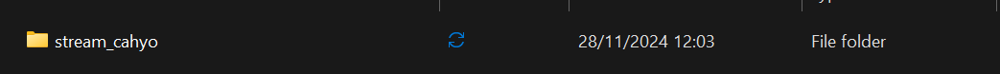

# Praktikum 1: Dart Streams

#### **Langkah 1: Buat Project Baru**


#### **Langkah 2: Buka file ``main.dart``**
```dart
import 'package:flutter/material.dart';

void main() {
  runApp(const MyApp());
}

class MyApp extends StatelessWidget {
  const MyApp({super.key});

  @override
  Widget build(BuildContext context) {
    return MaterialApp(
      title: 'Stream - Cahyo Adi Prasetia', // Soal 1
      theme: ThemeData(
        primarySwatch: Colors.deepOrange, // Soal 1
      ),
      home: const StreamHomePage(),
    );
  }
}

class StreamHomePage extends StatefulWidget {
  const StreamHomePage({super.key});

  @override
  State<StreamHomePage> createState() => _StreamHomePageState();
}

class _StreamHomePageState extends State<StreamHomePage> {
  @override

  Widget build(BuildContext context) {
    return Container();
  }
}
```

**Soal 1**

* Tambahkan **nama panggilan Anda** pada ``title`` app sebagai identitas hasil pekerjaan Anda.
```dart
  @override
  Widget build(BuildContext context) {
    return MaterialApp(
      title: 'Stream - Cahyo Adi Prasetia', // Soal 1
      theme: ThemeData(
        primarySwatch: Colors.deepOrange, // Soal 1
      ),
      home: const StreamHomePage(),
    );
  }
}
```
* Gantilah warna tema aplikasi sesuai kesukaan Anda.
```dart
      theme: ThemeData(
        primarySwatch: Colors.deepOrange, // Soal 1
      ),
```