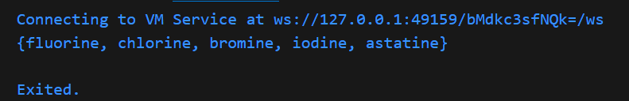

# Praktikum 1 : Eksperimen Tipe Data List
### Langkah 1
Ketik atau salin kode program berikut ke dalam void main().\

### Langkah 2
Silakan coba eksekusi (Run) kode pada langkah 1 tersebut. Apa yang terjadi? Jelaskan!\
Jawab :
> Yang terjadi menghasilkan output dibawah ini :
\
Penjelasan singkat mengenai kode diatas :
>- Membuat sebuah list dengan elemen [1, 2, 3] 
>- Mengecek apakah panjang list sama dengan 3. Jika benar, program berjalan, jika tidak program akan berhenti.
>- Mengecek apakah elemen kedua dalam list(indeks 1) adalah 2. Jika benar program lanjut, jika tidak program akan berhenti
>- Mencetak panjang list (yaitu 3).
>- Mencetak elemen kedua dari list (yaitu 2).
>- Mengubah nilai elemen kedua list dari 2 menjadi 1
>- Mengecek apakah elemen kedua dari list sekarang adalah 1. Jika benar, program lanjut.
>- Mencetak elemen kedua dari list yang diubah (yaitu 1).
### Langkah 3
Ubah kode pada langkah 1 menjadi variabel final yang mempunyai index = 5 dengan default value = null. Isilah nama dan NIM Anda pada elemen index ke-1 dan ke-2. Lalu print dan capture hasilnya.

Apa yang terjadi ? Jika terjadi error, silakan perbaiki.
>Jawab :\
\
Yang terjadi adalah eror, karena mencoba menetapkan nilai bertipe string ke sebuah elemen dari list yang diharapkan bertipe int?.

>Berikut adalah perbaikan kode :\

>Output :\

# Praktikum 2
### Langkah 1
Ketik atau salin kode berikut ke dalam fungsi main().\

### Langkah 2
Silakan coba eksekusi (Run) kode pada langkah 1 tersebut. Apa yang terjadi? Jelaskan! Lalu perbaiki jika terjadi error.
>Jawab :\
Yang terjadi adalah menghasilkan output seperti ini:
\
Penjelasan singkat dari program diatas adalah membuat Set yang berisi nama-nama unsur halogen dan mencetaknya. Set tersebut memiliki urutan tetap dan tidak mengizinkan duplikat jika ada elemen yang sama dimasukkan.
### Langkah 3
Tambahkan kode program berikut, lalu coba eksekusi (Run) kode Anda.\

Apa yang terjadi ? Jika terjadi error, silakan perbaiki namun tetap menggunakan ketiga variabel tersebut. Tambahkan elemen nama dan NIM Anda pada kedua variabel Set tersebut dengan dua fungsi berbeda yaitu .add() dan .addAll(). Untuk variabel Map dihapus, nanti kita coba di praktikum selanjutnya.
>Jawab :\
Tidak terjadi error secara sintaksis karena Dart mendukung pendeklarasian set dengan cara yang ditunjukkan. Berikut penjelasan kecil kode diatas :
>- var names1 = <String>{};\
Mendeklarasikan sebuah Set kosong dengan tipe String menggunakan sintaks <String>{}.
>- Set<String> names2 = {};\
Deklarasi yang sama seperti names1, tetapi menggunakan bentuk tipe eksplisit Set<String>.

>Berikut adalah perbaikan kode sesuai tugas yang diminta :\

>Output :
