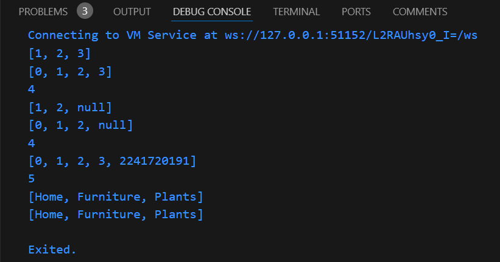

# Praktikum 1 : Eksperimen Tipe Data List
### Langkah 1
Ketik atau salin kode program berikut ke dalam void main().\

### Langkah 2
Silakan coba eksekusi (Run) kode pada langkah 1 tersebut. Apa yang terjadi? Jelaskan!\
Jawab :
> Yang terjadi menghasilkan output dibawah ini :
\
Penjelasan singkat mengenai kode diatas :
>- Membuat sebuah list dengan elemen [1, 2, 3] 
>- Mengecek apakah panjang list sama dengan 3. Jika benar, program berjalan, jika tidak program akan berhenti.
>- Mengecek apakah elemen kedua dalam list(indeks 1) adalah 2. Jika benar program lanjut, jika tidak program akan berhenti
>- Mencetak panjang list (yaitu 3).
>- Mencetak elemen kedua dari list (yaitu 2).
>- Mengubah nilai elemen kedua list dari 2 menjadi 1
>- Mengecek apakah elemen kedua dari list sekarang adalah 1. Jika benar, program lanjut.
>- Mencetak elemen kedua dari list yang diubah (yaitu 1).
### Langkah 3
Ubah kode pada langkah 1 menjadi variabel final yang mempunyai index = 5 dengan default value = null. Isilah nama dan NIM Anda pada elemen index ke-1 dan ke-2. Lalu print dan capture hasilnya.

Apa yang terjadi ? Jika terjadi error, silakan perbaiki.
>Jawab :\
\
Yang terjadi adalah eror, karena mencoba menetapkan nilai bertipe string ke sebuah elemen dari list yang diharapkan bertipe int?.

>Berikut adalah perbaikan kode :\

>Output :\

# Praktikum 2 : Eksperimen Tipe Data Set
### Langkah 1
Ketik atau salin kode berikut ke dalam fungsi main().\

### Langkah 2
Silakan coba eksekusi (Run) kode pada langkah 1 tersebut. Apa yang terjadi? Jelaskan! Lalu perbaiki jika terjadi error.
>Jawab :\
Yang terjadi adalah menghasilkan output seperti ini:
\
Penjelasan singkat dari program diatas adalah membuat Set yang berisi nama-nama unsur halogen dan mencetaknya. Set tersebut memiliki urutan tetap dan tidak mengizinkan duplikat jika ada elemen yang sama dimasukkan.
### Langkah 3
Tambahkan kode program berikut, lalu coba eksekusi (Run) kode Anda.\

Apa yang terjadi ? Jika terjadi error, silakan perbaiki namun tetap menggunakan ketiga variabel tersebut. Tambahkan elemen nama dan NIM Anda pada kedua variabel Set tersebut dengan dua fungsi berbeda yaitu .add() dan .addAll(). Untuk variabel Map dihapus, nanti kita coba di praktikum selanjutnya.
>Jawab :\
Tidak terjadi error secara sintaksis karena Dart mendukung pendeklarasian set dengan cara yang ditunjukkan. Berikut penjelasan kecil kode diatas :
>- var names1 = <String>{};\
Mendeklarasikan sebuah Set kosong dengan tipe String menggunakan sintaks <String>{}.
>- Set<String> names2 = {};\
Deklarasi yang sama seperti names1, tetapi menggunakan bentuk tipe eksplisit Set<String>.

>Berikut adalah perbaikan kode sesuai tugas yang diminta :\

>Output :\

# Praktikum 3 : Eksperimen Tipe Data Maps
### Langkah 1 :
Ketik atau salin kode program berikut ke dalam fungsi main().\

### Langkah 2 :
Silakan coba eksekusi (Run) kode pada langkah 1 tersebut. Apa yang terjadi? Jelaskan! Lalu perbaiki jika terjadi error.
>Jawab :\
>1. var gifts = { ... };: Ini mendefinisikan sebuah Map bernama gifts yang berisi pasangan key-value:
>- 'first' sebagai key dengan nilai 'partridge'
>- 'second' sebagai key dengan nilai 'turtledoves'
>- 'fifth' sebagai key dengan nilai 1 (tipe integer)
>2. var nobleGases = { ... };: Ini mendefinisikan sebuah Map bernama nobleGases yang juga berisi pasangan key-value:
>- 2 sebagai key dengan nilai 'helium'
>- 10 sebagai key dengan nilai 'neon'
>- 18 sebagai key dengan nilai 2 (tipe integer)
>3. print(gifts); dan print(nobleGases);: Mencetak isi dari kedua map. Hasilnya adalah representasi string dari map yang berisi pasangan key-value.

>Output :\

### Langkah 3
Tambahkan kode program berikut, lalu coba eksekusi (Run) kode Anda.\
\
Apa yang terjadi? Jika terjadi error, silakan perbaiki.
>Jawab :
Tidak terjadi error secara sintaksis, tetapi ada beberapa hal yang perlu diperbaiki. Berikut adalah penjelasannya :
>1. gifts : Didefinisikan sebagai sebuah Map dengan key bertipe String dan value bertipe campuran (String dan int). Kemudian, pada bagian setelahnya mengubah nilai dari key 'fifth' menjadi 'golden rings', yang juga valid.
>2. nobleGases : Didefinisikan sebagai sebuah Map dengan key bertipe int dan value bertipe campuran (String dan int). Kemudian mengubah nilai key 18 menjadi 'argon'.
>3. mhs1 : Dideklarasikan sebagai Map dengan key dan value bertipe String, tetapi saat ini kosong.
>4. mhs2 : Dideklarasikan sebagai Map dengan key bertipe int dan value bertipe String, tetapi saat ini kosong.

> Berikut adalah perbaikan kode sesuai tugas yang diminta :\

> Output :\

# Praktikum 4 : Eksperimen Tipe Data List: Spread dan Control-flow Operators
### Langkah 1:
Ketik atau salin kode program berikut ke dalam fungsi main().\

### Langkah 2 :
Silakan coba eksekusi (Run) kode pada langkah 1 tersebut. Apa yang terjadi? Jelaskan! Lalu perbaiki jika terjadi error.
>Jawab :\
Terdapat beberapa masalah pada kode diatas :
>- Error pada print(list1) : Tidak ada variabel yang disebut list1. Sebagai gantinya, seharusnya mencetak list atau mengganti list1 menjadi list.
>- Penggunaan spread operator: Penggunaan ...list di dalam list2 sudah benar. Berfungsi untuk menambahkan semua elemen dari list ke dalam list2.

> Perbaikan kode yang benar :\

> Output :\

### Langkah 3
Tambahkan kode program berikut, lalu coba eksekusi (Run) kode Anda.\

Apa yang terjadi ? Jika terjadi error, silakan perbaiki.

Tambahkan variabel list berisi NIM Anda menggunakan Spread Operators. Dokumentasikan hasilnya dan buat laporannya!
>Jawab :\
Terdapat masalah yang perlu diperhatikan :
>1. Error pada list1 = [1, 2, null]; : Ini akan menyebabkan error karena list1 belum dideklarasikan. Kamu harus mendeklarasikan list1 terlebih dahulu.
>2. ...?list1 : Ini adalah penggunaan null-aware spread operator. Jika list1 bernilai null, maka list3 tidak akan menambahkan elemen dari list1. Namun, jika list1 sudah dideklarasikan dan bukan null, maka akan berfungsi dengan baik.

> Berikut adalah kode yang diperbaiki :\

> Output :\

### Langkah 4
Tambahkan kode program berikut, lalu coba eksekusi (Run) kode Anda.\
\
Apa yang terjadi ? Jika terjadi error, silakan perbaiki. Tunjukkan hasilnya jika variabel promoActive ketika true dan false.
>Jawab :
Tidak ada error sintaksis, tetapi perlu ada deklarasi untuk variabel promoActive agar dapat digunakan dalam ekspresi conditional.

> Berikut adalah kode yang sudah diperbaiki sesuai tugas :\

> Output ketika promoActive True :\
\
nav akan berisi ['Home', 'Furniture', 'Plants', 'Outlet'].

> Output ketika promoActive False :\
\
nav akan berisi  ['Home', 'Furniture', 'Plants'].

### Langkah 5
Tambahkan kode program berikut, lalu coba eksekusi (Run) kode Anda.\

Apa yang terjadi ? Jika terjadi error, silakan perbaiki. Tunjukkan hasilnya jika variabel login mempunyai kondisi lain.
>Jawab :\
Terjadi error pada kode diatas, karena login belum dideklarasikan dalam kode.

> Berikut adalah kode yang sudah diperbaiki sesuai tugas :\

> Output jika login adalah 'Manager':\
\
List nav2 akan berisi ['Home', 'Furniture', 'Plants', 'Inventory'].
 
> Output jika login adalah kondisi lain, misalnya 'Staff' :\
\
List nav2 akan berisi: ['Home', 'Furniture', 'Plants'].

### Langkah 6
Tambahkan kode program berikut, lalu coba eksekusi (Run) kode Anda.\

Apa yang terjadi ? Jika terjadi error, silakan perbaiki. Jelaskan manfaat Collection For dan dokumentasikan hasilnya.
> Jawab :
Terjadi Error: Pada baris var listofString = ['#0', for (var i in listofInts) '#i'];, variabel i seharusnya digunakan di dalam string interpolation (#${i}) untuk mencetak nilai dari variabel i.

> Berikut adalah perbaikan kode sesusai tugas :\

> Output :\

> Manfaat Collection For:
>- Collection for di Dart berguna untuk membentuk list (atau set map) dengan lebih dinamis. Dan juga bisa membuat elemen-elemen baru dalam list berdasarkan hasil iterasi atau kondisi tertentu
>- Kelebihan :
>1. Mengurangi boilerplate kode dengan menggabungkan operasi loop dalam satu ekspresi.
>2. Membuat kode lebih bersih dan mudah dibaca.