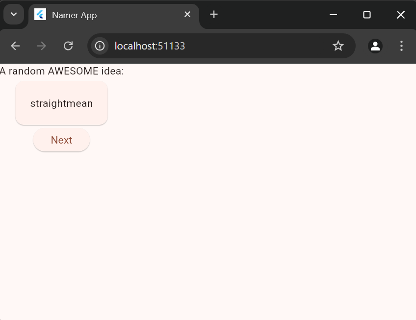
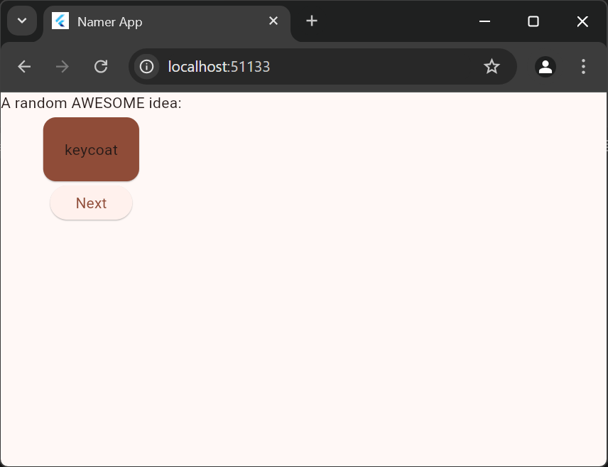
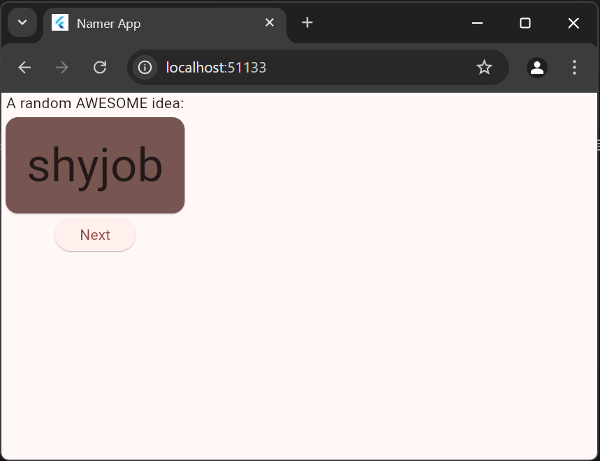
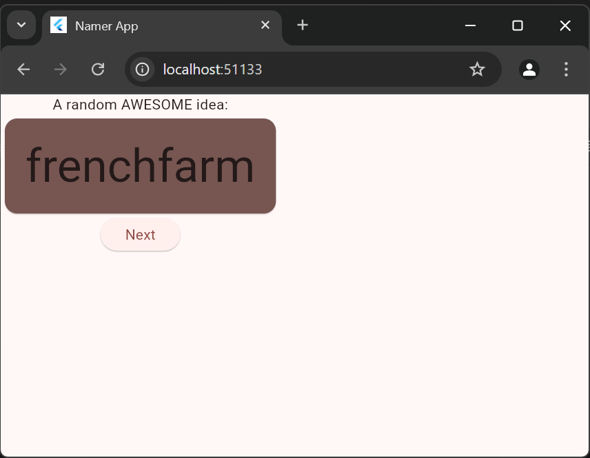
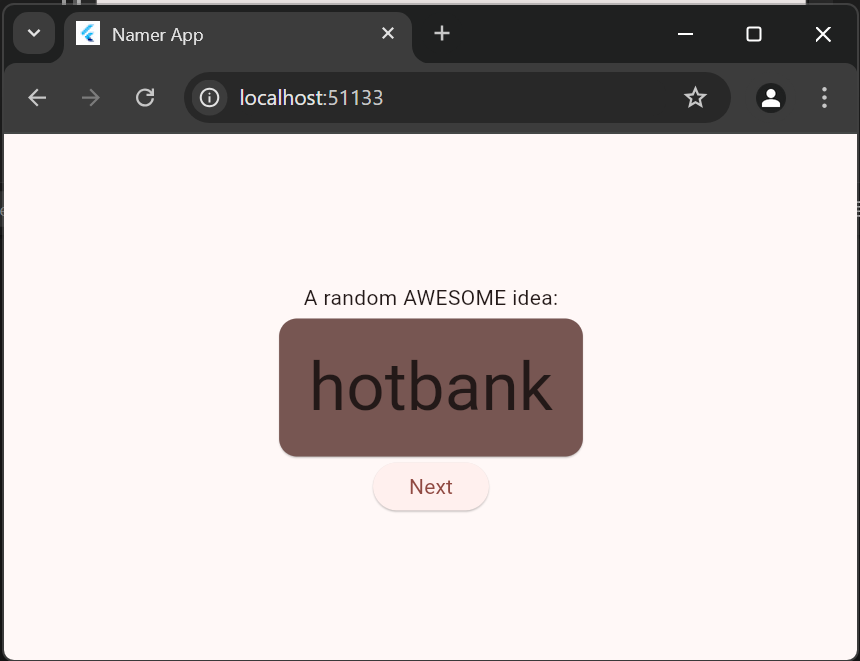
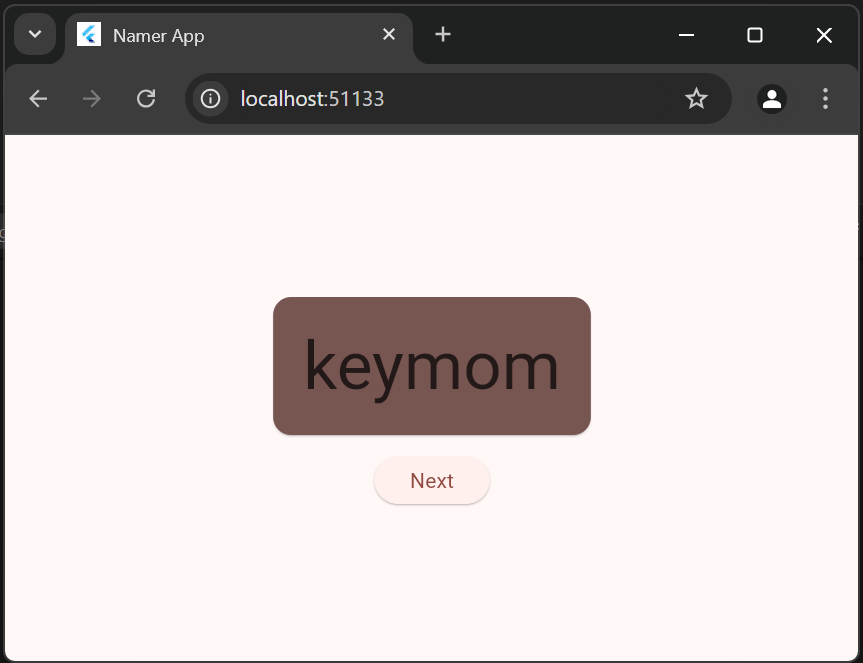
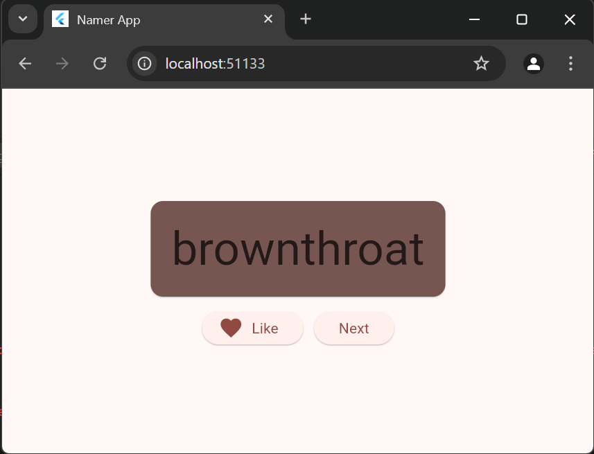
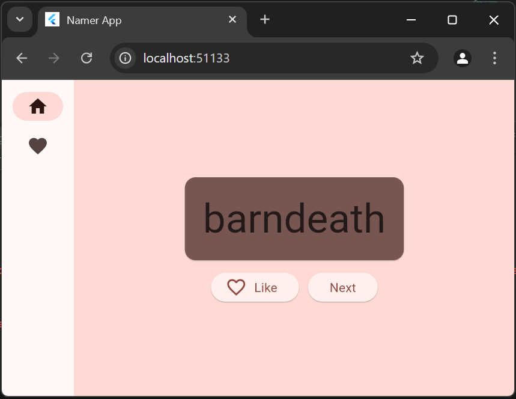
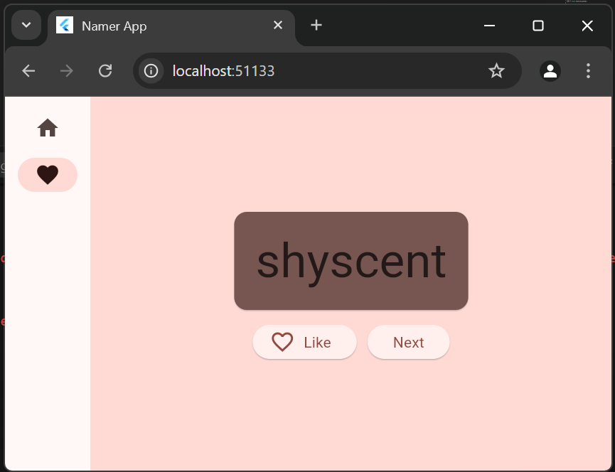
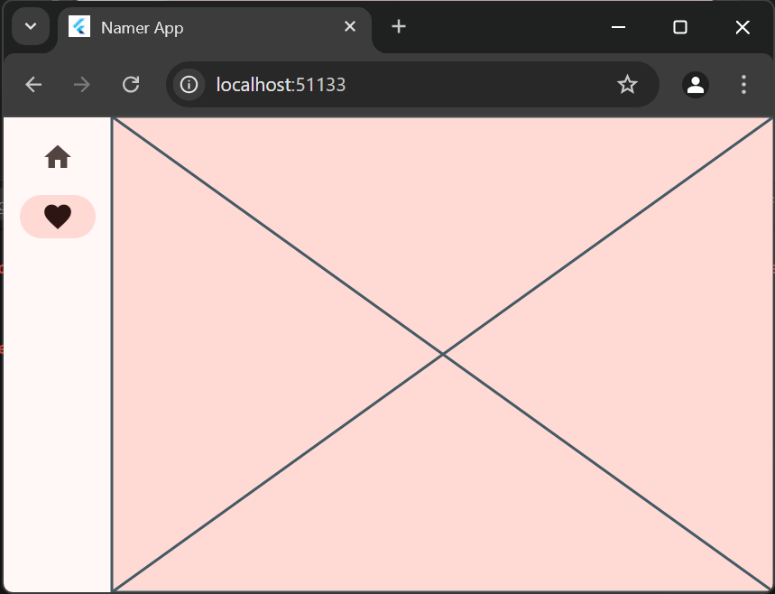

# flutter_application_1

A new Flutter project.

## Getting Started

#### 1. Membuat Project Baru
> 

```dart
pubspec.yaml

name: flutter_application_1
description: "A new Flutter project."
# The following line prevents the package from being accidentally published to
# pub.dev using `flutter pub publish`. This is preferred for private packages.
publish_to: 'none' # Remove this line if you wish to publish to pub.dev

# The following defines the version and build number for your application.
# A version number is three numbers separated by dots, like 1.2.43
# followed by an optional build number separated by a +.
# Both the version and the builder number may be overridden in flutter
# build by specifying --build-name and --build-number, respectively.
# In Android, build-name is used as versionName while build-number used as versionCode.
# Read more about Android versioning at https://developer.android.com/studio/publish/versioning
# In iOS, build-name is used as CFBundleShortVersionString while build-number is used as CFBundleVersion.
# Read more about iOS versioning at
# https://developer.apple.com/library/archive/documentation/General/Reference/InfoPlistKeyReference/Articles/CoreFoundationKeys.html
# In Windows, build-name is used as the major, minor, and patch parts
# of the product and file versions while build-number is used as the build suffix.
version: 0.0.1+1

environment:
  sdk: '>=2.19.4 <4.0.0'

# Dependencies specify other packages that your package needs in order to work.
# To automatically upgrade your package dependencies to the latest versions
# consider running `flutter pub upgrade --major-versions`. Alternatively,
# dependencies can be manually updated by changing the version numbers below to
# the latest version available on pub.dev. To see which dependencies have newer
# versions available, run `flutter pub outdated`.
dependencies:
  flutter:
    sdk: flutter
  
  english_words: ^4.0.0
  provider: ^6.0.0


dev_dependencies:
  flutter_test:
    sdk: flutter

  # The "flutter_lints" package below contains a set of recommended lints to
  # encourage good coding practices. The lint set provided by the package is
  # activated in the `analysis_options.yaml` file located at the root of your
  # package. See that file for information about deactivating specific lint
  # rules and activating additional ones.
  flutter_lints: ^2.0.0

# For information on the generic Dart part of this file, see the
# following page: https://dart.dev/tools/pub/pubspec

# The following section is specific to Flutter packages.
flutter:

  # The following line ensures that the Material Icons font is
  # included with your application, so that you can use the icons in
  # the material Icons class.
  uses-material-design: true

  # To add assets to your application, add an assets section, like this:
  # assets:
  #   - ../images/a_dot_burr.jpeg
  #   - ../images/a_dot_ham.jpeg

  # An image asset can refer to one or more resolution-specific "variants", see
  # https://flutter.dev/assets-and-../images/#resolution-aware

  # For details regarding adding assets from package dependencies, see
  # https://flutter.dev/assets-and-../images/#from-packages

  # To add custom fonts to your application, add a fonts section here,
  # in this "flutter" section. Each entry in this list should have a
  # "family" key with the font family name, and a "fonts" key with a
  # list giving the asset and other descriptors for the font. For
  # example:
  # fonts:
  #   - family: Schyler
  #     fonts:
  #       - asset: fonts/Schyler-Regular.ttf
  #       - asset: fonts/Schyler-Italic.ttf
  #         style: italic
  #   - family: Trajan Pro
  #     fonts:
  #       - asset: fonts/TrajanPro.ttf
  #       - asset: fonts/TrajanPro_Bold.ttf
  #         weight: 700
  #
  # For details regarding fonts from package dependencies,
  # see https://flutter.dev/custom-fonts/#from-packages

```
```dart
analysis_options.yaml

# This file configures the analyzer, which statically analyzes Dart code to
# check for errors, warnings, and lints.
#
# The issues identified by the analyzer are surfaced in the UI of Dart-enabled
# IDEs (https://dart.dev/tools#ides-and-editors). The analyzer can also be
# invoked from the command line by running `flutter analyze`.

# The following line activates a set of recommended lints for Flutter apps,
# packages, and plugins designed to encourage good coding practices.
include: package:flutter_lints/flutter.yaml

linter:
  # The lint rules applied to this project can be customized in the
  # section below to disable rules from the `package:flutter_lints/flutter.yaml`
  # included above or to enable additional rules. A list of all available lints
  # and their documentation is published at https://dart.dev/lints.
  #
  # Instead of disabling a lint rule for the entire project in the
  # section below, it can also be suppressed for a single line of code
  # or a specific dart file by using the `// ignore: name_of_lint` and
  # `// ignore_for_file: name_of_lint` syntax on the line or in the file
  # producing the lint.
  rules:
    prefer_const_constructors: false
    prefer_final_fields: false
    use_key_in_widget_constructors: false
    prefer_const_literals_to_create_immutables: false
    prefer_const_constructors_in_immutables: false
    avoid_print: false
    # avoid_print: false  # Uncomment to disable the `avoid_print` rule
    # prefer_single_quotes: true  # Uncomment to enable the `prefer_single_quotes` rule

# Additional information about this file can be found at
# https://dart.dev/guides/language/analysis-options
```
```dart
main.dart

import 'package:english_words/english_words.dart';
import 'package:flutter/material.dart';
import 'package:provider/provider.dart';

void main() {
  runApp(const MyApp());
}

class MyApp extends StatelessWidget {
  const MyApp({super.key});

  // This widget is the root of your application.
  @override
  Widget build(BuildContext context) {
    return ChangeNotifierProvider(
      create: (context) => MyAppState(),
      child: MaterialApp(
        title: 'Namer App',
        theme: ThemeData(
          useMaterial3: true,
          colorScheme: ColorScheme.fromSeed(seedColor: Colors.deepOrange),
        ),
        home: MyHomePage(),
      ),
    );
  }
}
class MyAppState extends ChangeNotifier {
    var current = WordPair.random();
}

class MyHomePage extends StatelessWidget {
  @override
  Widget build(BuildContext context) {
    var appState = context.watch<MyAppState>();
    return Scaffold(
      body: Column(
        children: [
          Text('A random idea:'),
          Text(appState.current.asLowerCase),
        ],
      ),
    );
  }
}
```
> Output pada main.dart:\


#### 2. Menambahkan Tombol
```dart
main.dart

import 'package:english_words/english_words.dart';
import 'package:flutter/material.dart';
import 'package:provider/provider.dart';

void main() {
  runApp(const MyApp());
}

class MyApp extends StatelessWidget {
  const MyApp({super.key});

  // This widget is the root of your application.
  @override
  Widget build(BuildContext context) {
    return ChangeNotifierProvider(
      create: (context) => MyAppState(),
      child: MaterialApp(
        title: 'Namer App',
        theme: ThemeData(
          useMaterial3: true,
          colorScheme: ColorScheme.fromSeed(seedColor: Colors.deepOrange),
        ),
        home: MyHomePage(),
      ),
    );
  }
}
class MyAppState extends ChangeNotifier {
    var current = WordPair.random();
}

class MyHomePage extends StatelessWidget {
  @override
  Widget build(BuildContext context) {
    var appState = context.watch<MyAppState>();
    return Scaffold(
      body: Column(
        children: [
          Text('A random AWESOME idea:'),
          Text(appState.current.asLowerCase),

          ElevatedButton(
            onPressed: () {
              print('button pressed!');
            },
            child: Text('Next'),
          ),
        ],
      ),
    );
  }
}
```
> Output pada main.dart:\


```dart
add metode getNext

    void getNext() {
      current = WordPair.random();
      notifyListeners();
    }
```
```dart
          ElevatedButton(
            onPressed: () {
              appState.getNext();
            },
            child: Text('Next'),
          ),
```
> Output:\


#### 3. Memperindah tampilan aplikasi
```dart
mengekstrak widget

class MyHomePage extends StatelessWidget {
  @override
  Widget build(BuildContext context) {
    var appState = context.watch<MyAppState>();
    var pair = appState.current;
    return Scaffold(
      body: Column(
        children: [
          Text('A random AWESOME idea:'),
          BigCard(pair: pair),

          ElevatedButton(
            onPressed: () {
              appState.getNext();
            },
            child: Text('Next'),
          ),
        ],
      ),
    );
  }
}
```
```dart
menambahkan kartu

  @override
  Widget build(BuildContext context) {
    return Card(
      child: Padding(
        padding: const EdgeInsets.all(20),
        child: Text(pair.asLowerCase),
      ),
    );
  }
```
>Output:\

```dart
tema dan gaya

  @override
  Widget build(BuildContext context) {
    final theme = Theme.of(context);

    return Card(
      color: theme.colorScheme.primary,
      child: Padding(
        padding: const EdgeInsets.all(20),
        child: Text(pair.asLowerCase),
      ),
    );
  }
```
> Output:\
 

```dart
textTheme

  @override
  Widget build(BuildContext context) {
    final theme = Theme.of(context);

    final style = theme.textTheme.displayMedium!.copyWith(
      color: theme.colorScheme.onSurface,
    );

    return Card(
      color: theme.colorScheme.secondary,
      child: Padding(
        padding: const EdgeInsets.all(20),
        child: Text(pair.asLowerCase, style: style),
      ),
    );
  }
```
> Output :\


```dart
Meningkatkan aksebilitas

  @override
  Widget build(BuildContext context) {
    final theme = Theme.of(context);

    final style = theme.textTheme.displayMedium!.copyWith(
      color: theme.colorScheme.onSurface,
    );

    return Card(
      color: theme.colorScheme.secondary,
      child: Padding(
        padding: const EdgeInsets.all(20),

        child: Text(
          pair.asLowerCase, 
          style: style,
          semanticsLabel: "${pair.first} ${pair.second}",
        ),
      ),
    );
  }
```
> Output:\


```dart
Menempatkan UI di tengah

class MyHomePage extends StatelessWidget {
  @override
  Widget build(BuildContext context) {
    var appState = context.watch<MyAppState>();
    var pair = appState.current;

    return Scaffold(
      body: Center(
        child: Column(
          mainAxisAlignment: MainAxisAlignment.center,
          children: [
            Text('A random AWESOME idea:'),
            BigCard(pair: pair),
        
            ElevatedButton(
              onPressed: () {
                appState.getNext();
              },
              child: Text('Next'),
            ),
          ],
        ),
      ),
    );
  }
```
> Output :\


```dart
Menghapus Widget Text

class MyHomePage extends StatelessWidget {
  @override
  Widget build(BuildContext context) {
    var appState = context.watch<MyAppState>();
    var pair = appState.current;

    return Scaffold(
      body: Center(
        child: Column(
          mainAxisAlignment: MainAxisAlignment.center,
          children: [
            BigCard(pair: pair),
            SizedBox(height: 10),
            ElevatedButton(
              onPressed: () {
                appState.getNext();
              },
              child: Text('Next'),
            ),
          ],
        ),
      ),
    );
  }
```
> Output:\


#### 4. Menambahkan Fungsi
```dart
Menambahkan Logika Bisnis

    var favorites = <WordPair>[];

    void toogleFavorite(){
      if (favorites.contains(current)){
        favorites.remove(current);
      } else {
        favorites.add(current);
      }
      notifyListeners();
    }
```
```dart
Menambahkan Tombol

class MyHomePage extends StatelessWidget {
  @override
  Widget build(BuildContext context) {
    var appState = context.watch<MyAppState>();
    var pair = appState.current;

    return Scaffold(
      body: Center(
        child: Column(
          mainAxisAlignment: MainAxisAlignment.center,
          children: [
            BigCard(pair: pair),
            SizedBox(height: 10),
            Row(
              mainAxisSize: MainAxisSize.min,
              children: [
                ElevatedButton.icon(
                  onPressed: (){
                    appState.toogleFavorite();
                  },
                  icon: Icon(Icons.favorite),
                  label: Text('Like'),
                ),
                SizedBox(width: 10),
                
                ElevatedButton(
                  onPressed: () {
                    appState.getNext();
                  },
                  child: Text('Next'),
                ),
              ],
            ),
          ],
        ),
      ),
    );
  }
```
> Output:\


#### 5. Menambahkan kolom samping navigasi
```dart
class MyHomePage extends StatelessWidget {
  @override
  Widget build(BuildContext context) {
    return Scaffold(
      body: Row(
        children: [
          SafeArea(
            child: NavigationRail(
              extended: false,
              destinations: [
                NavigationRailDestination(
                  icon: Icon(Icons.home), 
                  label: Text('Home'),
                  ),
                  NavigationRailDestination(
                    icon: Icon(Icons.favorite), 
                    label: Text('Favorites'),
                  ),
              ],
              selectedIndex: 0,
              onDestinationSelected: (value){
                print('selected: $value');
              },
            ) 
          ),
          Expanded(
            child: Container(
              color: Theme.of(context).colorScheme.primaryContainer,
              child: GeneratorPage(),
            ),
          )
        ],
      ),
    );
  }
}

class GeneratorPage extends StatelessWidget {
  @override
  Widget build(BuildContext context) {
    var appState = context.watch<MyAppState>();
    var pair = appState.current;

    IconData icon;
    if (appState.favorites.contains(pair)) {
      icon = Icons.favorite;
    } else {
      icon = Icons.favorite_border;
    }

    return Center(
      child: Column(
        mainAxisAlignment: MainAxisAlignment.center,
        children: [
          BigCard(pair: pair),
          SizedBox(height: 10),
          Row(
            mainAxisSize: MainAxisSize.min,
            children: [
              ElevatedButton.icon(
                onPressed: () {
                  appState.toogleFavorite();
                },
                icon: Icon(icon),
                label: Text('Like'),
              ),
              SizedBox(width: 10),
              ElevatedButton(
                onPressed: () {
                  appState.getNext();
                },
                child: Text('Next'),
              ),
            ],
          ),
        ],
      ),
    );
  }
```
> Output:\


```dart
Widget stateless vs stateful

class MyHomePage extends StatefulWidget {
  @override
  State<MyHomePage> createState() => _MyHomePageState();
}

class _MyHomePageState extends State<MyHomePage> {

  var selectedIndex = 0;
  @override
  Widget build(BuildContext context) {
    return Scaffold(
      body: Row(
        children: [
          SafeArea(
            child: NavigationRail(
              extended: false,
              destinations: [
                NavigationRailDestination(
                  icon: Icon(Icons.home), 
                  label: Text('Home'),
                  ),
                  NavigationRailDestination(
                    icon: Icon(Icons.favorite), 
                    label: Text('Favorites'),
                  ),
              ],
              selectedIndex: selectedIndex,
              onDestinationSelected: (value){
                setState(() {
                  selectedIndex = value;
                });
              },
            ) 
          ),
          Expanded(
            child: Container(
              color: Theme.of(context).colorScheme.primaryContainer,
              child: GeneratorPage(),
            ),
          )
        ],
      ),
    );
  }
```
> Output:\

```dart
Menggunakan selectedIndex

    Widget page;
    switch (selectedIndex) {
      case 0:
        page = GeneratorPage();
        break;
      case 1:
        page = Placeholder();
        break;
      default:
        throw UnimplementedError('no widget for $selectedIndex');
    }
```
> Output:\
