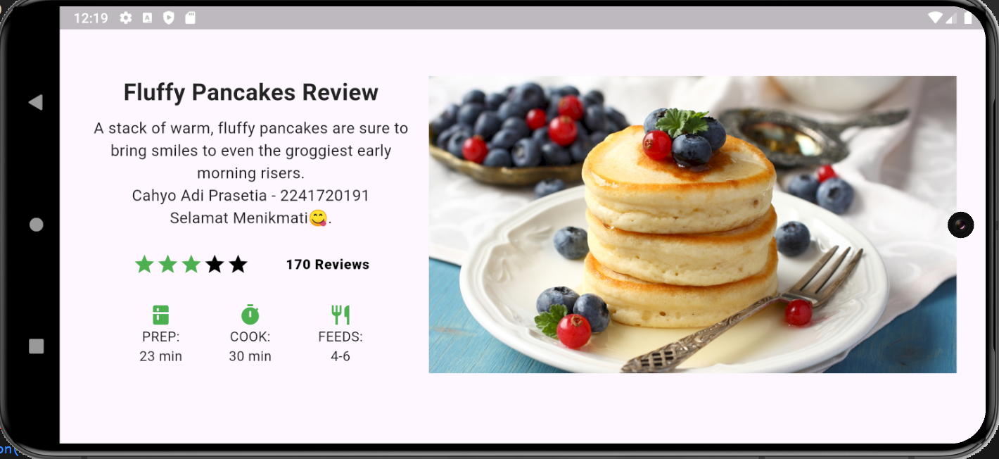

# **Basic Layout Flutter (Tugas 1)**
```dart

main.dart

import 'package:flutter/material.dart';

void main() {
  runApp(const MyApp());
}

class MyApp extends StatelessWidget {
  const MyApp({super.key});

  @override
  Widget build(BuildContext context) {
    // Rating bintang
    final stars = Row(
      mainAxisSize: MainAxisSize.min,
      children: [
        Icon(Icons.star, color: Colors.green[500]),
        Icon(Icons.star, color: Colors.green[500]),
        Icon(Icons.star, color: Colors.green[500]),
        const Icon(Icons.star, color: Colors.black),
        const Icon(Icons.star, color: Colors.black),
      ],
    );

    // Section ratings
    final ratings = Container(
      padding: const EdgeInsets.all(8),
      child: Row(
        mainAxisAlignment: MainAxisAlignment.spaceEvenly,
        children: [
          stars,
          const Text(
            '170 Reviews',
            style: TextStyle(
              color: Colors.black,
              fontWeight: FontWeight.w800,
              fontFamily: 'Roboto',
              letterSpacing: 0.5,
              fontSize: 14,
            ),
          ),
        ],
      ),
    );

    // Icon dan informasi tambahan
    final iconList = Container(
      padding: const EdgeInsets.all(4),
      child: Row(
        mainAxisAlignment: MainAxisAlignment.spaceEvenly,
        children: [
          Column(
            children: [
              Icon(Icons.kitchen, color: Colors.green[500]),
              const Text('PREP:'),
              const Text('23 min'),
            ],
          ),
          Column(
            children: [
              Icon(Icons.timer, color: Colors.green[500]),
              const Text('COOK:'),
              const Text('30 min'),
            ],
          ),
          Column(
            children: [
              Icon(Icons.restaurant, color: Colors.green[500]),
              const Text('FEEDS:'),
              const Text('4-6'),
            ],
          ),
        ],
      ),
    );

    // Layout utama
    return MaterialApp(
      debugShowCheckedModeBanner: false,
      title: 'Flutter Basic Layout: Cahyo Adi Prasetia - 2241720056',
      theme: ThemeData(
        colorScheme: ColorScheme.fromSeed(seedColor: Colors.deepPurple),
        useMaterial3: true,
      ),
      home: Scaffold(
        body: Center(
          child: Padding(
            padding: const EdgeInsets.all(16.0),
            child: Column( 
              mainAxisAlignment: MainAxisAlignment.center, 
              children: [
                Row(
                  mainAxisSize: MainAxisSize.min,
                  crossAxisAlignment: CrossAxisAlignment.start,
                  children: [
                    // Kolom teks sebelah kiri
                    SizedBox(
                      width: MediaQuery.of(context).size.width * 0.35,
                      child: Column(
                        crossAxisAlignment: CrossAxisAlignment.start,
                        children: [
                          const Align(
                            alignment: Alignment.center,
                            child: Text(
                              'Fluffy Pancakes Review',
                              style: TextStyle(
                                fontWeight: FontWeight.bold,
                                fontSize: 24,
                                color: Colors.black87,
                              ),
                              textAlign: TextAlign.center,
                            ),
                          ),
                          const SizedBox(height: 8),
                          const Text(
                            'A stack of warm, fluffy pancakes are sure to bring '
                            'smiles to even the groggiest early morning risers.\n'
                            'Cahyo Adi Prasetia - 2241720191\n'
                            'Selamat Menikmati😋.',
                            style: TextStyle(fontSize: 16),
                            textAlign: TextAlign.center,
                          ),
                          const SizedBox(height: 16),
                          ratings,
                          const SizedBox(height: 16),
                          iconList,
                        ],
                      ),
                    ),
                    const SizedBox(width: 16),
                    // Gambar sebelah kanan
                    Container(
                      width: MediaQuery.of(context).size.width * 0.57,
                      color: Colors.blueGrey[50],
                      child: Image.asset(
                        'images/pancakage.jpg',
                        fit: BoxFit.cover,
                      ),
                    ),
                  ],
                ),
              ],
            ),
          ),
        ),
      ),
    );
  }
}

```
> Hasil Output:\
