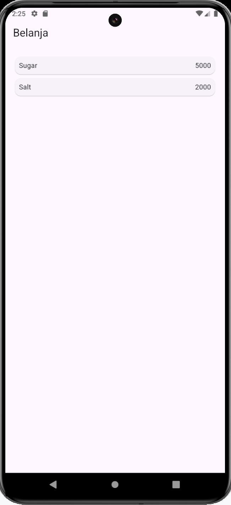
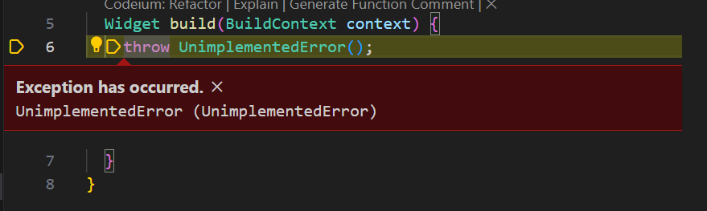

# Praktikum 5: Membangun Navigasi di Flutter
### **Langkah 1: Siapkan project baru**

### **Langkah 2: Mendefinisikan Route**
```dart
homepage.dart

import 'package:flutter/material.dart';

class HomePage extends StatelessWidget {
  @override
  Widget build(BuildContext context) {
    throw UnimplementedError();
  }
}
```
```dart
item_page.dart

import 'package:flutter/material.dart';

class ItemPage extends StatelessWidget {
  @override
  Widget build(BuildContext context) {
    throw UnimplementedError();
  } 
}
```
### **Langkah 3: Lengkapi Kode di ```main.dart```**
```dart
void main() {
  runApp(MaterialApp(
    initialRoute: '/',
    routes: {
      '/': (context) => HomePage(),
      '/item': (context) => ItemPage(),
    },
  ));
}
```
### **Langkah 4: Membuat data model**
```dart
item.dart

class Item {
  String? name;
  int? price;

  Item({this.name, this.price});  
}
```
### **Langkah 5: Lengkapi kode di ```Homepage```**
```dart
import 'package:belanja/models/item.dart';
import 'package:flutter/material.dart';

class HomePage extends StatelessWidget {
  final List<Item> items = [
    Item(name: 'Sugar', price: 5000),
    Item(name: 'Salt', price: 2000),
  ];
  @override
  Widget build(BuildContext context) {
    throw UnimplementedError();
  }
}
```
### **Langkah 6: Membuat ListView dan itemBuilder**
```dart
home_page.dart

  Widget build(BuildContext context) {
    return Scaffold(
      appBar: AppBar(
        title: Text('Belanja'),
      ),
      body: Container(
        margin: EdgeInsets.all(8),
        child: ListView.builder(
          padding: EdgeInsets.all(8),
          itemCount: items.length,
          itemBuilder: (context, index) {
            final item = items[index];
            return Card(
              child: Container(
                margin: EdgeInsets.all(8),
                child: Row(
                  children: [
                    Expanded(child: Text(item.name)),
                    Expanded(
                      child: Text(
                        item.price.toString(),
                        textAlign: TextAlign.end,
                      ),
                    )
                  ],
                ),
              ),
            );
          },
        ),
      ),
    );
  }
```
> Hasil Output:\

### **Langkah 7: Menambahkan aksi pada ListView**
```dart
            return InkWell(
              onTap: (){
                Navigator.pushNamed(context, '/item');
              },
```
> Pada saat aplikasi dijalankan dan ListView disentuh menghasilkan kesalahan:\


# Tugas Praktikum 2
1. Untuk melakukan pengiriman data ke halaman berikutnya, cukup menambahkan informasi arguments pada penggunaan ```Navigator```. Perbarui kode pada bagian ```Navigator``` menjadi seperti berikut:
```dart
home_page.dart

            return InkWell(
              onTap: (){
                Navigator.pushNamed(context, '/item', arguments: item);
              },
```
2. Pembacaan nilai yang dikirimkan pada halaman sebelumnya dapat dilakukan menggunakan ModalRoute. Tambahkan kode berikut pada blok fungsi build dalam halaman ItemPage. Setelah nilai didapatkan, anda dapat menggunakannya seperti penggunaan variabel pada umumnya.
```dart
item_page.dart

import 'package:flutter/material.dart';
import '/models/item.dart';

class ItemPage extends StatelessWidget {
  @override
  Widget build(BuildContext context) {
    final itemArgs = ModalRoute.of(context)!.settings.arguments as Item;
    
    return Scaffold(
      appBar: AppBar(
        title: const Text('Item Details'),
      ),
      body: Padding(
        padding: const EdgeInsets.all(16.0),
        child: Column(
          crossAxisAlignment: CrossAxisAlignment.start,
          children: [
            Text(
              itemArgs.name,
              style: const TextStyle(fontSize: 24, fontWeight: FontWeight.bold),
            ),
            const SizedBox(height: 8),
            Text(
              'Item Price: ${itemArgs.price}',
              style: const TextStyle(fontSize: 16),
            ),
          ],
        ),
      ),
    );
  } 
}
```
> Output yang dihasilkaan:\
