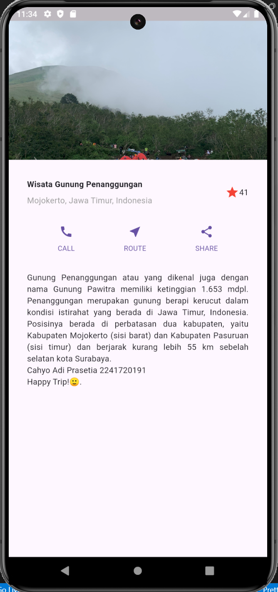

# Praktikum 1 : Membangun Layout di Flutter
### **Langkah 1: Buat Project Baru**

### **Langkah 4: Implementasi title row**
```dart
final Widget titleSection = Container(
    padding: const EdgeInsets.all(32),
    child: Row(
      children: [
        Expanded(
          /*soal 1*/
          child: Column(
            crossAxisAlignment: CrossAxisAlignment.start,
            children: [
              /*soal 2*/
              Container(
                padding: const EdgeInsets.only(bottom: 8),
                child: const Text(
                  'Wisata Gunung di Batu',
                  style: TextStyle(
                    fontWeight: FontWeight.bold,
                  ),
                ),
              ),
              Text(
                'Batu, Malang, Indonesia',
                style: TextStyle(
                  color: Colors.grey[500],
                ),
              ),
            ],
          ),
        ),
        Icon(
          Icons.star,
          color: Colors.red[500],
        ),
        const Text('41'),
      ],
    )
  );
``` 
# Praktikum 2: Implementasi button row
### **Langkah 1: Buat method Column _buildButtonColumn**
```dart
 Column _buildButtonColumn(Color color, IconData icon, String label) {
  return Column(
    mainAxisSize: MainAxisSize.min,
    mainAxisAlignment: MainAxisAlignment.center,
    children: [
      Icon(icon, color: color),
      Container(
        margin: const EdgeInsets.only(top: 8),
        child: Text(
          label,
          style: TextStyle(
            fontSize: 12,
            fontWeight: FontWeight.w400,
            color: color,
          ),
        ),
      ),
      ],
    );
```
### **Langkah 2: Buat widget buttonSection**
```dart
    Color color = Theme.of(context).primaryColor;

    Widget buttonSection = Row(
      mainAxisAlignment: MainAxisAlignment.spaceEvenly,
      children: [
        _buildButtonColumn(color, Icons.call, 'CALL'),
        _buildButtonColumn(color, Icons.near_me, 'ROUTE'),
        _buildButtonColumn(color, Icons.share, 'SHARE'),
      ],
    );
```
### **Langkah 3: Tambah button section ke body**
```dart
        body: Column(
          children: [
            titleSection,
            buttonSection,
          ],
```
# Praktikum 3: Implementasi text section
### **Langkah 1: Buat widget textSection**
```dart
    Widget textSection = Container(
      padding: const EdgeInsets.all(32),
      child: const Text(
        'Gunung Penanggungan atau yang dikenal juga dengan nama Gunung Pawitra memiliki ketinggian 1.653 mdpl.\t'
        'Penanggungan merupakan gunung berapi kerucut dalam kondisi istirahat yang berada di Jawa Timur, Indonesia.'
        '\tPosisinya berada di perbatasan dua kabupaten, yaitu Kabupaten Mojokerto (sisi barat) dan Kabupaten Pasuruan (sisi timur)\t' 
        'dan berjarak kurang lebih 55 km sebelah selatan kota Surabaya.\n'
        'Cahyo Adi Prasetia\t2241720191\n'
        'Happy Trip!🙂.',
        softWrap: true,
        textAlign: TextAlign.justify,
      ),
    );
```
### **Langkah 2: Tambahkan variabel text section ke body**
```dart
        body: Column(
          children: [
            titleSection,
            buttonSection,
            textSection,
          ],
```
# Praktikum 4: Implementasi image section
### **Langkah 1: Siapkan aset gambar**
```dart
flutter:

  # The following line ensures that the Material Icons font is
  # included with your application, so that you can use the icons in
  # the material Icons class.
  uses-material-design: true

  # To add assets to your application, add an assets section, like this:
  assets:
     - images/penanggungan.jpg
```
### **Langkah 2: Tambahkan gambar ke body**
```dart
        body: ListView(
          children: [
            Image.asset(
              'images/penanggungan.jpg',
              width: 600,
              height: 240,
              fit: BoxFit.cover,
            ),
```
> Final Output:\

