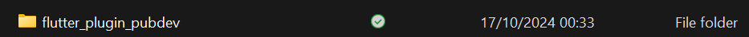

# Praktikum Menerapkan Plugin di Project Flutter

### Langkah 1: Buat Project Baru

### Langkah 2: Menambahkan Plugin

### Langkah 3: Buat file ```red_text_widget.dart```
```dart
import 'package:flutter/material.dart';

class RedTextWidget extends StatelessWidget {
  const RedTextWidget({Key? key}) : super(key: key);

  @override
  Widget build(BuildContext context) {
    return Container();
  }
}
```
### Langkah 4: Tambahkan Widget AutoSizeText
```dart
import 'package:auto_size_text/auto_size_text.dart';
import 'package:flutter/material.dart';

class RedTextWidget extends StatelessWidget {
  const RedTextWidget({Key? key}) : super(key: key);

  @override
  Widget build(BuildContext context) {
    return AutoSizeText(
      text,
      style: const TextStyle(color: Colors.red, fontSize: 14),
      maxLines: 2,
      overflow: TextOverflow.ellipsis,
    );
  }
}
```
> Jawab:\
Error pada 'text' dikarenakan belum mendeklarasikan variabel dan parameter.
### Langkah 5: Buat Variabel text dan parameter di constructor
 ```dart 
  final String text;
  const RedTextWidget({Key? key, required this.text}) : super(key: key);
```
### Langkah 6: Tambahkan widget di main.dart
```dart
children: <Widget>[
            Container(
              color: Colors.yellowAccent,
              width: 50,
              child: const RedTextWidget(
                text: 'You have pushed the button this many times:', 
                ),
            ),
            Container(
              color: Colors.greenAccent,
              width: 100,
              child: const Text(
                'You have pushed the button this many times:',
              ),
            ),
```
> Output:\


## Tugas Praktikum
2. Jelaskan maksud dari langkah pada praktikum tersebut!\
Jawab:\
Maksud dari langkah 2 diatas adalah menambahkan paket ```Auto Size Text``` ke dalam proyek Flutter. Paket ini berfungsi untuk membuat teks menyesuaikan ukurannya secara otomatis.

3. Jelaskan maksud dari langkah 5 pada praktikum tersebut!\
Jawab :\
Maksud dari langkah 5 diatas adalah cara membuat widget di Flutter yang menerima teks sebagai parameter dan mendefinisikan key yang opsional.

4. Pada langkah 6 terdapat dua widget yang ditambahkan, jelaskan fungsi dan perbedaannya!\
Jawab :\
**Fungsi**:\
a. **Container 1(RedTextWidget):**\
```color: Colors.yellowAccent:``` Memberikan warna latar belakang kuning pada container.\
```width: 50:``` Mengatur lebar container menjadi 50 piksel.\
```RedTextWidget:``` Menggunakan widget ```RedTextWidget``` (yang dibuat sebelumnya) untuk menampilkan teks ```"You have pushed the button this many times:"```.\
b. **Container 2(RedTextWidget):**\
```color: Colors.greenAccent:``` Memberikan warna latar belakang hijau pada container.\
```width: 100:``` Mengatur lebar container menjadi 100 piksel.\
```Text:``` Menggunakan widget bawaan Flutter, yaitu Text, untuk menampilkan teks yang sama.\
**Perbedaan:**\
a. Widget yang digunakan:\
**Container 1** menggunakan custom widget RedTextWidget.\
**Container 2** menggunakan widget bawaan Flutter, yaitu Text.\
b. Lebar Container:\
**Container 1** memiliki lebar 50 piksel.\
**Container 2** memiliki lebar 100 piksel, sehingga lebih lebar dibanding container pertama.\
c. Warna Latar Belakang:\
**Container 1** memiliki warna latar belakang kuning.\
**Container 2** memiliki warna latar belakang hijau.\
Dari segi fungsionalitas, keduanya menampilkan teks yang sama, tetapi perbedaannya terletak pada penggunaan widget custom dan properti visual seperti ukuran dan warna.

5. Jelaskan maksud dari tiap parameter yang ada di dalam plugin auto_size_text!\
Jawab :<table>
    <thead>
        <tr>
            <td>Parameter</td>
            <td>Deskripsi</td>
        </tr>
    </thead>
    <tbody>
        <tr>
            <td>key</td>
            <td>Mengontrol bagaimana satu widget menggantikan widget lain di tree.</td>
        </tr>
        <tr>
            <td>textKey</td>
            <td>Mengatur kunci untuk widget Teks yang dihasilkan.</td>
        </tr>
        <tr>
            <td>style</td>
            <td>Melakukan manipulasi pada text.</td>
        </tr>
        <tr>
            <td>minFontSize</td>
            <td>Batasan ukuran teks minimum yang akan digunakan saat mengubah ukuran teks secara otomatis. Diabaikan jika presetFontSizes diatur.</td>
        </tr>
        <tr>
            <td>maxFontSize</td>
            <td>The maximum text size constraint to be used when auto-sizing text. Is being ignored if presetFontSizes is set.</td>
        </tr>
        <tr>
            <td>stepGranularity</td>
            <td>The step size in which the font size is being adapted to constraints.</td>
        </tr>
        <tr>
            <td>presetFontSizes</td>
            <td>Mendefinisikan semua ukuran font yang mungkin. Penting: presetFontSizes harus dalam urutan menurun.</td>
        </tr>
        <tr>
            <td>group</td>
            <td>Menyinkronkan ukuran beberapa AutoSizeText</td>
        </tr>
        <tr>
            <td>textAlign</td>
            <td>Bagaimana teks harus disejajarkan secara horizontal.</td>
        </tr>
        <tr>
            <td>textDirection</td>
            <td>Arah teks. Ini menentukan bagaimana nilai textAlign seperti TextAlign.start dan TextAlign.end.</td>
        </tr>
        <tr>
            <td>locale</td>
            <td>Digunakan untuk memilih font ketika karakter Unicode yang sama dapat dirender secara berbeda, tergantung pada lokasi.</td>
        </tr>
        <tr>
            <td>softWrap</td>
            <td>Apakah teks harus berhenti pada jeda baris sesuai ukuran Widget yang menampung.</td>
        </tr>
        <tr>
            <td>wrapWords</td>
            <td>Apakah kata-kata yang tidak muat dalam satu baris harus dibungkus. Defaultnya adalah true.</td>
        </tr>
        <tr>
            <td>overflow</td>
            <td>Bagaimana overflow harus ditangani.</td>
        </tr>
        <tr>
            <td>overflow</td>
            <td>Untuk menangani overflow.</td>
        </tr>
        <tr>
            <td>overflowReplacement</td>
            <td>Jika teks meluap dan tidak sesuai dengan batasnya, widget ini akan ditampilkan.</td>
        </tr>
        <tr>
            <td>textScaleFactor</td>
            <td>Jumlah piksel font untuk setiap piksel. Juga memengaruhi minFontSize, maxFontSize, dan presetFontSizes.</td>
        </tr>
        <tr>
            <td>maxLines</td>
            <td>Jumlah maksimal baris yang di buat.</td>
        </tr>
        <tr>
            <td>semanticsLabel</td>
            <td>Membuat label semantic pada teks ini.</td>
        </tr>
    </tbody>
</table>