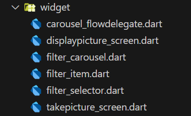
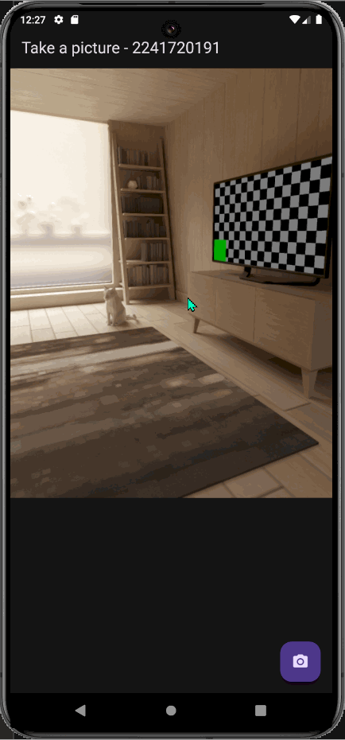

>2. Gabungkan hasil praktikum 1 dengan hasil praktikum 2 sehingga setelah melakukan pengambilan foto, dapat dibuat filter carouselnya!\
Jawab :\
Caranya adalah memasukkan file hasil praktikum 2 ke dalam praktikum 1\


Menambahkan parameter ``imagePath`` pada ``PhotoFilterCarousel``
```dart
@immutable
class PhotoFilterCarousel extends StatefulWidget {
  const PhotoFilterCarousel({super.key, required this.filePath});

  final String filePath;

  @override
  State<PhotoFilterCarousel> createState() => _PhotoFilterCarouselState();
}
```

Menambahkan ``filtercarousel`` pada ``displaypicturescreen``
```dart
import 'package:flutter/material.dart';

import 'package:kamera_flutter/widget/filter_carousel.dart';

class DisplayPictureScreen extends StatelessWidget {
  final String imagePath;

  const DisplayPictureScreen({super.key, required this.imagePath});

  @override
  Widget build(BuildContext context) {
    return Scaffold(
      appBar: AppBar(title: const Text('Display the Picture - 2241720191')),
      // The image is stored as a file on the device. Use the `Image.file`
      // constructor with the given path to display the image.
      body: PhotoFilterCarousel(filePath: (imagePath)),
    );
  }
}
```

### **Hasilnya**


>3. Jelaskan maksud void async pada praktikum 1?\
Jawab:\
void ``async`` berguna membuat fungsi menjadi asynchronous. Fungsi asynchronous sendiri adalah fungsi yang dapat berjalan secara bersamaan dengan fungsi lainnya. Dengan kata lain, fungsi tersebut tidak akan menunggu proses yang sedang berjalan selesai terlebih dahulu.

>4. Jelaskan fungsi dari anotasi @immutable dan @override ?\
Jawab:\
``@immutable`` digunakan untuk membuat class menjadi immutable, artinya class tersebut tidak dapat diubah setelah dibuat. Immutable class adalah class yang tidak dapat diubah setelah dibuat. Immutable class tidak memiliki setter dan tidak dapat diubah nilainya.\
``@override`` digunakan untuk menandakan bahwa method yang dideklarasikan pada class tersebut merupakan method yang diwarisi dari superclass. Dengan kata lain, method tersebut diwarisi dari superclass dan di-override pada class tersebut.