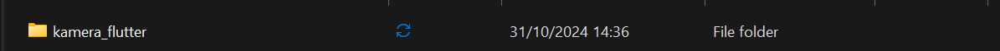
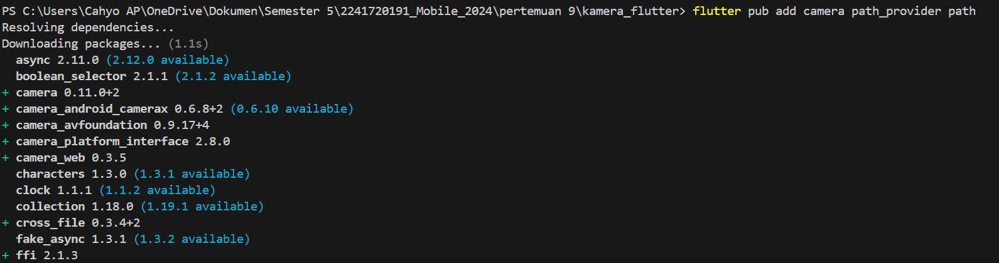
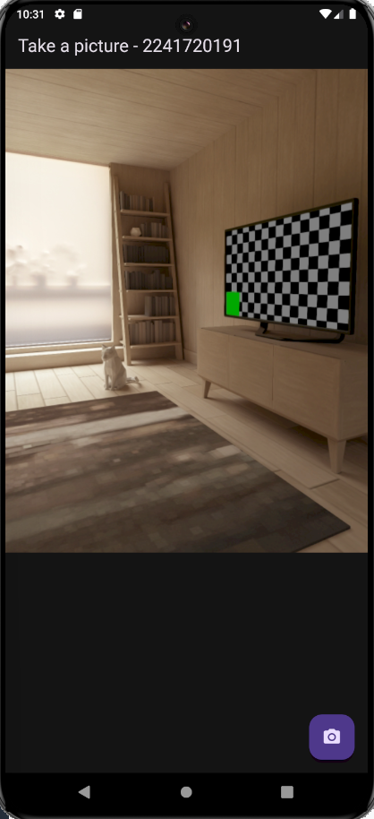

# Praktikum 1: Mengambil Foto dengan Kamera di Flutter

### **Langkah 1: Buat Project Baru**


### **Langkah 2: Tambah dependensi yang diperlukan**


### **Langkah 3: Ambil Sensor Kamera dari device**
```dart
main.dart

Future<void> main() async {
  WidgetsFlutterBinding.ensureInitialized();

  final cameras = await availableCameras();

  final firstCamera = cameras.first;
  
  runApp(const MyApp());
} 
```

### **Langkah 4: Buat dan Inisialisasi Camera Controller**
```dart
takepicture_screen.dart

import 'package:camera/camera.dart';
import 'package:flutter/material.dart';

class TakePictureScreen extends StatefulWidget {
  const TakePictureScreen({
    super.key,
    required this.camera,
  });

  final CameraDescription camera;

  @override
  TakePictureScreenState createState() => TakePictureScreenState();
}

class TakePictureScreenState extends State<TakePictureScreen> {
  late CameraController _controller;
  late Future<void> _initializeControllerFuture;

  @override
  void initState() {
    super.initState();
    _controller = CameraController(
      widget.camera, 
      ResolutionPreset.medium
    );

    _initializeControllerFuture = _controller.initialize();
  }

  @override
  void dispose() {
    _controller.dispose();
    super.dispose();
  }

  @override
  Widget build(BuildContext context) {
    return Container();
  }
}
```

### **Langkah 5: Gunakan Camera Preview untuk menampilkan preview foto**
```dart
  Widget build(BuildContext context) {
    return Scaffold(
      appBar: AppBar(title: const Text('Take a picture - 2241720191')),

      body: FutureBuilder<void>(
        future: _initializeControllerFuture,
        builder: (context, snapshot) {
          if (snapshot.connectionState == ConnectionState.done) {
            return CameraPreview(_controller);
          } else {
            return const Center(child: CircularProgressIndicator());
          }
        },
      ),
```

### **Langkah 6: Ambil foto dengan CameraController**
```dart
 floatingActionButton: FloatingActionButton(
        onPressed: () async {
          try {
            await _initializeControllerFuture;
            final image = await _controller.takePicture();
          } catch (e) {
            print(e);
          }
        },
        child: const Icon(Icons.camera_alt),
      ),
```

### **Langkah 7: Buat widget baru DisplayPictureScreen**
```dart
import 'package:flutter/material.dart';
import 'dart:io';

class DisplayPictureScreen extends StatelessWidget {
  final String imagePath;

  const DisplayPictureScreen({super.key, required this.imagePath});

  @override
  Widget build(BuildContext context) {
    return Scaffold(
      appBar: AppBar(title: const Text('Display the Picture - NIM Anda')),
      // The image is stored as a file on the device. Use the `Image.file`
      // constructor with the given path to display the image.
      body: Image.file(File(imagePath)),
    );
  }
}
```

### **Langkah 8: Edit main.dart**
```dart
  runApp(
    MaterialApp(
      theme: ThemeData.dark(),
      home: TakePictureScreen(
        camera: firstCamera
      ),
    debugShowCheckedModeBanner: false,
    ),
  ); 
```

### **Langkah 9: Menampilkan hasil foto**
```dart
          try {
            await _initializeControllerFuture;
            final image = await _controller.takePicture();

            if (!context.mounted) return;

            await Navigator.of(context).push(
              MaterialPageRoute(
                builder: (context) => DisplayPictureScreen(
                  imagePath: image.path,
                ),
              ),
            );
          } catch (e) {
            print(e);
          }
```

### **Hasilnya**
